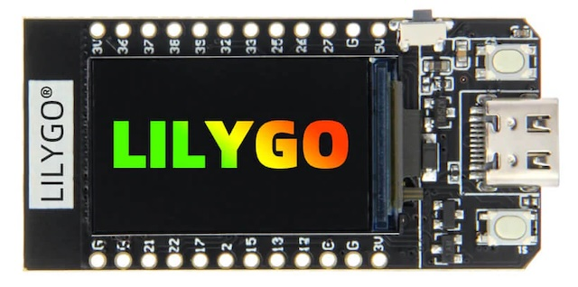
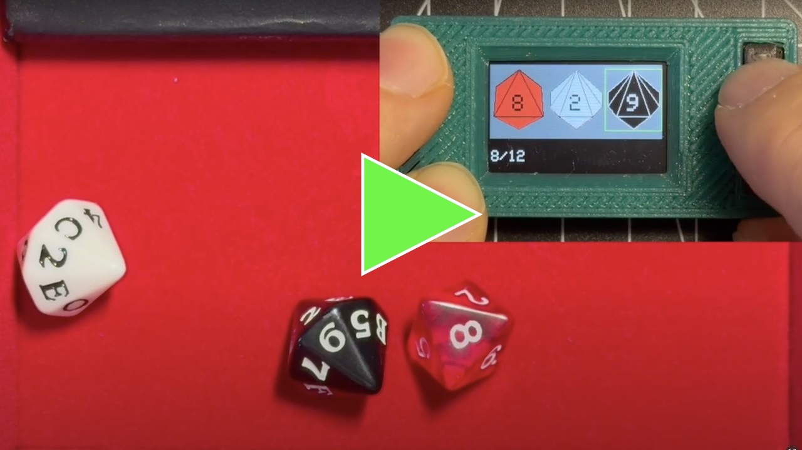

# BIP39dice on ESP32

<table>
<tr>
<td width="300">

</td>
<td>

**BIP39dice** is a simple ESP32-based tool to securely generate BIP39 mnemonic phrases using physical dice rolls.  
At this early stage, it is designed specifically for the [LilyGO® TTGO T-Display 1.14 Inch LCD](https://lilygo.cc/products/lilygo%C2%AE-ttgo-t-display-1-14-inch-lcd-esp32-control-board).

</td>
</tr>
</table>

---

## What it does

- Supports **12-word** or **24-word** [BIP39](https://github.com/bitcoin/bips/blob/master/bip-0039.mediawiki) mnemonics.
- Allows you to generate random BIP39 words using one of the following two methods:  
  – An 8-sided die (**d8**) combined with **two hexadecimal dice** (0–9, A–F), of **two different colors**.  
  – An 8-sided die (**d8**) combined with **two 16-sided dice**, also of **two different colors**.  
  The two colored dice are read in a fixed order (e.g., white first, then black) to avoid human bias and maximize entropy.
- Calculates the 12th or 24th word according to the BIP39 standard (only the required entropy from the last throw will be used).
- Displays the final **12-word** or **24-word** mnemonic directly on the screen at the end.
- All processing is done **offline** on the ESP32 device.
- Lower button is used to advance, upper button is used to select (see demo in the video below)
-  **For demonstration purposes only**, keeping the **select button** pressed will automatically simulate random dice rolls and advance through the process.

Quick demo (links to YouTube video):

---

## Notes

- This project is currently tailored **only** for the **LilyGO TTGO T-Display** board.
- More boards and features may be supported in future versions.

---

## Requirements

This project was developed using the **Arduino IDE**.

### Arduino IDE setup:

1. Install ESP32 support:
   - **Tools → Board → Boards Manager**
   - Search for: `esp32` by **Espressif Systems**
   - Install the latest version.

2. Install required libraries:
   - **Library Manager → Search and install:**
     - `TFT_eSPI` by **Bodmer**
       - You must configure it for the LilyGO T-Display board (e.g. `Setup25_TTGO_T_Display.h`)
     - `Crypto` (any library that provides `SHA256` support, e.g., Arduino `Crypto` or `Arduino_Crypto`)

---

## Files

- `BIP39diceESP32.ino` – the main sketch.

---

Stay tuned for the YouTube link and further development.
